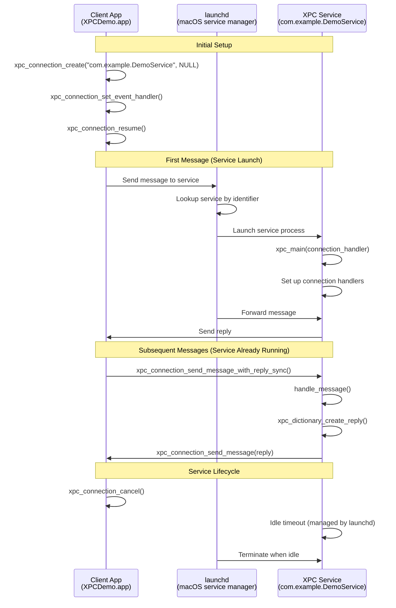
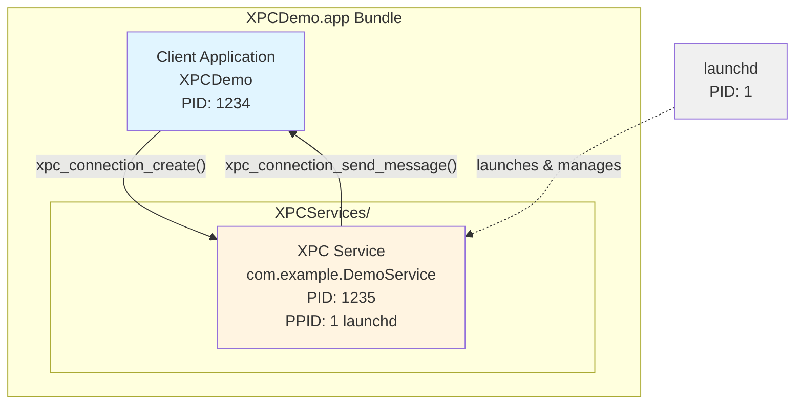

# XPC C API Demo

This project demonstrates inter-process communication using Apple's XPC (Cross-Process Communication) C API on macOS.

## Prerequisites

- **macOS 10.15 (Catalina) or later** - Required for XPC C API support
- **Xcode Command Line Tools** - Install with: `xcode-select --install`
- **clang compiler** - Included with Command Line Tools

## Overview

XPC is a structured, asynchronous IPC library native to macOS. This project contains **two complete demo implementations**, each showing a different approach to using XPC.

## How XPC Works

XPC enables secure inter-process communication on macOS through a service-based architecture:



**Key Concepts:**

1. **launchd Integration** - macOS's `launchd` manages service lifecycle automatically
2. **On-Demand Launch** - Services start only when needed, reducing resource usage
3. **Process Isolation** - Client and service run in separate processes for security
4. **Automatic Reconnection** - If service crashes, launchd restarts it on next message
5. **Bundle Discovery** - Services in `XPCServices/` are automatically discovered

## Project Structure

```
xpc/
├── demos/
│   ├── single-process/          # Simple demo - client and service in one process
│   │   ├── demo_simple.c        # Complete implementation
│   │   ├── Makefile             # Build configuration
│   │   └── README.md            # Detailed documentation
│   │
│   └── service-based/           # Production pattern - separate processes
│       ├── xpc_app.c            # Client application
│       ├── xpc_service.c        # XPC service
│       ├── AppInfo.plist        # App bundle config
│       ├── ServiceInfo.plist    # Service bundle config
│       ├── build_bundle.sh      # Bundle build script
│       ├── Makefile             # Build configuration
│       └── README.md            # Detailed documentation
│
├── Makefile                     # Top-level build - builds all demos
├── README.md                    # This file
└── QUICKSTART.md               # Quick start guide
```

## Two Approaches to XPC

### 1. Single-Process Demo ([demos/single-process/](demos/single-process/))

**Purpose**: Learn XPC APIs without inter-process complexity

- Client and service run in the same process
- Uses anonymous XPC connections
- Perfect for understanding XPC message flow
- Simple to build and debug

```bash
cd demos/single-process
make run
```

**When to use**: Learning, testing, prototyping

### 2. Service-Based Demo ([demos/service-based/](demos/service-based/)) ⭐ **RECOMMENDED**

**Purpose**: Production pattern with real inter-process communication

- Client and service in separate processes
- Uses proper `.xpc` bundle structure
- Service launches on-demand via launchd
- This is how real macOS apps implement XPC



```bash
cd demos/service-based
make run
```

**When to use**: Production applications, any real-world XPC usage

## Quick Start

### Build Everything

```bash
make all
```

### Run the Single-Process Demo

```bash
make run-single-process
```

Output shows XPC communication within one process - great for learning the APIs.

### Run the Service-Based Demo (Recommended)

```bash
make run-service-based
```

Output shows:
- Two separate processes (client and service)
- Service launched by macOS's launchd
- True inter-process communication

## Key XPC Concepts Demonstrated

Both demos demonstrate:

### 1. Message Patterns
- **Ping/Pong**: Simple request-response
- **Echo**: String data round-trip
- **Add**: Arithmetic operations with parameters
- **Info**: Service metadata and process information

### 2. XPC Object Types
- Dictionaries (property-list style)
- Strings, integers, and other data types
- Reply objects linked to original messages

### 3. Communication Modes
- **Synchronous**: `xpc_connection_send_message_with_reply_sync()` - blocks until reply
- **Asynchronous**: `xpc_connection_send_message_with_reply()` - callback-based

### 4. Connection Types
- **Anonymous connections** (single-process demo): Created with `xpc_connection_create(NULL, NULL)`
- **Named connections** (service-based demo): Created with `xpc_connection_create("service.name", NULL)`

### 5. Service Lifecycle
- **Manual setup** (single-process): Direct connection creation
- **xpc_main()** (service-based): Standard XPC service initialization with automatic lifecycle

## Comparison

| Feature | Single-Process | Service-Based |
|---------|---------------|---------------|
| **Processes** | 1 | 2 (client + service) |
| **Setup Complexity** | Simple | Moderate |
| **Connection Type** | Anonymous + endpoint | Named (by service ID) |
| **Service Launch** | Manual | Automatic (launchd) |
| **Security Isolation** | None | Process isolation |
| **Production Ready** | No | Yes ✓ |
| **Best For** | Learning | Real applications |

## Learning Path

1. **Start with single-process** ([demos/single-process/](demos/single-process/))
   - Understand XPC message structure
   - Learn connection APIs
   - See request-reply patterns
   - Debug easily in one process

2. **Move to service-based** ([demos/service-based/](demos/service-based/))
   - See how production apps use XPC
   - Understand bundle structure
   - Learn service lifecycle
   - Implement proper process separation

## What Each Demo Shows

### Single-Process Demo Features
- Creating anonymous XPC connections
- Using XPC endpoints for connection sharing
- Sending structured messages (dictionaries)
- Synchronous request-reply patterns
- Message handling and responses

### Service-Based Demo Features
- Proper XPC service bundle structure
- Service discovery by name
- `xpc_main()` service initialization
- Automatic service launch via launchd
- Inter-process communication
- Service lifecycle management
- Production-ready patterns

## XPC API Reference

### Core Functions Used

**Connection Management:**
- `xpc_connection_create("service.name", queue)` - Connect to named service
- `xpc_connection_create(NULL, NULL)` - Create anonymous listener
- `xpc_connection_create_from_endpoint()` - Create from endpoint
- `xpc_connection_set_event_handler()` - Set event/message handler
- `xpc_connection_resume()` - Activate connection
- `xpc_connection_cancel()` - Cancel connection

**Service Initialization:**
- `xpc_main()` - Initialize XPC service runtime (service-based pattern)

**Messaging:**
- `xpc_connection_send_message()` - Send message (fire-and-forget)
- `xpc_connection_send_message_with_reply_sync()` - Send and wait for reply
- `xpc_connection_send_message_with_reply()` - Send with async callback

**Dictionary Operations:**
- `xpc_dictionary_create()` - Create message dictionary
- `xpc_dictionary_create_reply()` - Create reply to a message
- `xpc_dictionary_set_string()` / `xpc_dictionary_get_string()` - String values
- `xpc_dictionary_set_int64()` / `xpc_dictionary_get_int64()` - Integer values

**Endpoints:**
- `xpc_endpoint_create()` - Create endpoint from connection

**Utilities:**
- `xpc_connection_get_pid()` - Get peer process ID
- `xpc_get_type()` - Get XPC object type

## Error Handling

Both demos handle common XPC errors:
- `XPC_ERROR_CONNECTION_INVALID` - Connection closed or invalid
- `XPC_ERROR_CONNECTION_INTERRUPTED` - Connection temporarily interrupted
- `XPC_ERROR_TERMINATION_IMMINENT` - Service about to terminate

## Building from Top Level

```bash
# Build all demos
make all

# Build specific demo
make single-process
make service-based

# Run specific demo
make run-single-process
make run-service-based

# Clean everything
make clean

# Show help
make help
```

## Troubleshooting

### Service Won't Launch

**Symptoms**: Client can't connect, or connection times out

**Solutions**:
1. **Check bundle structure** - Ensure `.xpc` bundle is in `XPCServices/` directory
2. **Verify Info.plist files** - Both app and service need valid plists
3. **Check bundle identifier** - `CFBundleIdentifier` in ServiceInfo.plist must match the name used in `xpc_connection_create()`
4. **Look for crashes** - Open Console.app and filter for your service name to see crash logs

### Connection Fails

**Symptoms**: `XPC_ERROR_CONNECTION_INVALID` immediately after connection attempt

**Solutions**:
1. **Bundle identifier mismatch** - The service name in code must exactly match `CFBundleIdentifier` in ServiceInfo.plist
2. **Service not in XPCServices/** - The service bundle must be at `AppName.app/Contents/XPCServices/ServiceName.xpc/`
3. **Missing CFBundleExecutable** - Ensure ServiceInfo.plist has `CFBundleExecutable` key
4. **Permissions** - Check that executables have execute permissions (`chmod +x`)

### Service Crashes

**Symptoms**: Connection interrupted errors, service restarts repeatedly

**Solutions**:
1. **Use Console.app** - Open Console.app, search for your service's process name
2. **Check crash reports** - Look in `~/Library/Logs/DiagnosticReports/`
3. **Debug the service** - Attach debugger: `lldb -n YourServiceName` or use Xcode
4. **Add logging** - Use `printf()` or `os_log()` to track execution flow

### Service Output Not Visible

**Issue**: `printf()` statements in service don't appear in terminal

**Explanation**: XPC services run as separate processes. Their stdout/stderr go to the unified logging system, not your terminal.

**Solutions**:
1. **Use Console.app** - Open Console.app and filter for your service's process name
2. **Use os_log** - Adopt unified logging for better integration
3. **Log to file** - Temporarily write to a file in `/tmp/` for debugging

### Common Build Errors

**"xpc/xpc.h not found"**: Install Xcode Command Line Tools with `xcode-select --install`

**"Undefined symbols for _xpc_..."**: Link against the system libraries (already handled in Makefiles)

## Security Considerations

When building production XPC services, consider these security best practices:

### Client Validation

```c
// Validate the client's code signature and entitlements
xpc_connection_t peer;  // from connection_handler
pid_t client_pid = xpc_connection_get_pid(peer);

// Check client credentials, audit token, etc.
// Use Security framework APIs to verify code signatures
```

### Message Parameter Validation

Always validate all message parameters:
- **Check types** - Use `xpc_get_type()` before accessing values
- **Validate ranges** - Check that integers are within acceptable bounds
- **Sanitize strings** - Verify string lengths, check for null terminators
- **Validate paths** - If accepting file paths, ensure they're within allowed directories

```c
// Example: Validate integer parameter
int64_t value = xpc_dictionary_get_int64(message, "count");
if (value < 0 || value > MAX_ALLOWED_COUNT) {
    // Reject invalid input
    return;
}
```

### Privilege Separation

- **Minimize privileges** - Services should run with minimal required privileges
- **Service Type** - Set appropriate `ServiceType` in plist (`Application` vs `System`)
- **Sandbox** - Consider sandboxing the service for additional isolation

### Production Best Practices

1. **Use code signing** - Sign both app and service bundles
2. **Validate entitlements** - Check that clients have required entitlements
3. **Rate limiting** - Implement request rate limiting to prevent abuse
4. **Error handling** - Never expose internal details in error messages
5. **Audit logging** - Log security-relevant events

## Advanced Topics

### Asynchronous Messaging

This demo uses synchronous messaging (`xpc_connection_send_message_with_reply_sync()`). For async messaging:

```c
// Asynchronous request-reply pattern
xpc_connection_send_message_with_reply(connection, msg,
    dispatch_get_main_queue(), ^(xpc_object_t reply) {
    // Handle reply in callback
    xpc_type_t type = xpc_get_type(reply);
    if (type != XPC_TYPE_ERROR) {
        // Process reply
        const char *response = xpc_dictionary_get_string(reply, "response");
        printf("Got async reply: %s\n", response);
    }
    xpc_release(reply);  // Don't forget to release
});
xpc_release(msg);  // Can release immediately - XPC retains it
```

Benefits of async messaging:
- Non-blocking - doesn't freeze the calling thread
- Better for UI applications
- Can handle multiple concurrent requests

### Connection Lifecycle Management

Production services should handle connection interruptions gracefully:

```c
// In client connection handler
if (event == XPC_ERROR_CONNECTION_INTERRUPTED) {
    // Service crashed or was killed - it will restart
    // XPC automatically reconnects, no action needed
    printf("Service interrupted, will reconnect automatically\n");
}
```

## Further Reading

- `man xpc` - Overview of XPC framework
- `man xpc_connection_create` - Connection creation and management
- `man xpc_object` - XPC object types and operations
- `man xpc_dictionary_create` - Dictionary operations
- `man xpc_main` - XPC service runtime (for bundled services)
- [Creating XPC Services](https://developer.apple.com/library/archive/documentation/MacOSX/Conceptual/BPSystemStartup/Chapters/CreatingXPCServices.html) - Apple Developer Documentation

For detailed documentation on each approach:
- [Single-Process Demo README](demos/single-process/README.md)
- [Service-Based Demo README](demos/service-based/README.md)

## License

This is demonstration code for educational purposes.
